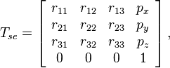

# Mobile Manipulation Capstone Project
**Submitted by: Yuchen Wang**

*Northwestern University*

## Introduction
In this capstone project, I wrote a software that plans a trajectory for the end-effector of the youBot mobile manipulator (a mobile base with four mecanum wheels and a 5R robot arm), performs odometry as the chassis moves, and performs feedback control to drive the youBot to pick up a block at a specified location, carry it to a desired location, and put it down.

## Implementation
### Reference Trajectory Generation
Given eight configurations indicating the relationship between end-effector, cube and world frame under different conditions, generate a reference trajectory for the gripper on frame {e}.

The output is written to a cvs file containing 13 attributes: **r11, r12, r13, r21, r22, r23, r31, r32, r33, px, py, pz, gripper state**

### youBot Kinematics Simulator
Given the current configuration of youBot(*Chassis phi, Chassis x, Chassis y, J1, J2, J3, J4, J5, W1, W2, W3, W4, Gripper*), joints speed and wheel speed, return the next configuration of the robot after a short time dt(*default as 0.01s*).

### Forward Control
